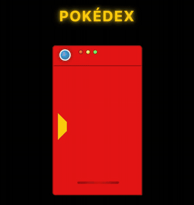

# Pokédex

**Boredom breeds overengineering.** Nobody needed another Pokédex. I was bored, made one anyway, then kept going until it had fuzzy search, offline support, and full keyboard access. All in vanilla JS.

[](https://pokedex.kanishk.live)
[](https://github.com/kanishk-upadhyay/pokedex/actions/workflows/ci.yml)
[](LICENSE)


<p align="center">
  
</p>

> Fast, offline-capable Pokédex PWA. Dependency-free vanilla JS, no build step. **[Try it live at pokedex.kanishk.live](https://pokedex.kanishk.live)**

---

## Highlights

**Frontend craft**

*   No framework, no build step, no dependencies. Just ES modules the browser runs directly.
*   Installable PWA that works fully offline. The service worker caches the app shell, API responses, and sprites.
*   Progressive rendering: the sprite paints before species and evolution data finish loading, so the screen fills instantly instead of waiting on the slowest request.
*   Full keyboard operability and screen-reader support (see [Accessibility](#accessibility)).
*   Dual-type Pokémon get a layered-depth name treatment tinted with the secondary type color, plus crisp pixel-art sprites, a front/back sprite flip, and clickable evolution chains.

**Engineering**

*   An LRU cache with TTL, plus in-flight request de-duplication, so repeated and concurrent lookups hit memory instead of the network.
*   Typo-tolerant fuzzy search: tiered matching backed by a threshold-bounded, rolling-row Levenshtein distance, extracted into a pure module (`js/search.js`) with unit tests.
*   A service worker with per-resource strategies: cache-first app shell, stale-while-revalidate API, cache-first immutable sprites.
*   Sprites served through the jsDelivr CDN mirror to sidestep `raw.githubusercontent.com` rate limiting.
*   A Content-Security-Policy and a service-worker hardening pass (see [Security](#security)).
*   Tests run in CI on every push via Node's built-in test runner.

---

## Features

*   **Comprehensive data.** Sprites (front and back), types, abilities, moves, and evolution chains for over 1,000 Pokémon species.
*   **Fuzzy search.** Find Pokémon by name or Pokédex number with typo tolerance that also handles special forms (for example, `charzard` surfaces `charizard`, `charizard-mega-x`, and `charizard-gmax`).
*   **Many ways to navigate.** D-pad for sequential browsing, a number pad for direct ID entry, clickable search suggestions, and full keyboard control with `?` for the shortcuts overlay.
*   **Sprite interaction.** Click a sprite (or press Space) to flip between front and back views.
*   **Evolution visualization.** Complete evolution lines rendered as clickable nodes, including branched chains.
*   **Offline first.** The whole experience keeps working with no network once assets are cached.

---

## Architecture

A modular architecture with a clear separation of concerns, and no build tooling between the source and the browser:

*   **`js/index.js`** Application entry point. Instantiates the controller and boots the app.
*   **`js/controller.js`** Orchestrator. Owns state and coordinates the other modules.
*   **`js/ui.js`** The view layer. All DOM rendering and user interaction.
*   **`js/api.js`** API communication, the LRU cache, request queueing, and storage helpers.
*   **`js/search.js`** Pure, unit-tested fuzzy search (tokenization plus Levenshtein).
*   **`js/dom.js`** Small helpers that build DOM nodes safely with text nodes and attributes.
*   **`sw.js`** Service worker for offline caching.

---

## Accessibility

*   Every interactive element is keyboard operable with Enter and Space, including the custom button-like controls (exposed with `role="button"`).
*   Visible `:focus-visible` rings on all controls, so keyboard focus is always obvious.
*   Status and error messages use `aria-live` and are color-coded by kind with icons, so meaning is never conveyed by color alone.
*   Motion respects `prefers-reduced-motion`.
*   Space opens the Pokédex when it is closed and flips the current sprite when it is open.

---

## Security

*   A strict **Content-Security-Policy** (`default-src 'self'` with tightly scoped `img-src` and `connect-src`) as a safety net against markup injection.
*   The DOM is built with text nodes and `setAttribute` rather than `innerHTML`, so untrusted PokéAPI data cannot inject markup in the first place.
*   The service worker only caches genuine, same-origin responses for the app shell and matches its API host exactly rather than by substring.
*   No third-party scripts or stylesheets are loaded, so there is effectively no script supply-chain surface.

---

## Tech Stack

*   **Frontend:** HTML5, CSS3, vanilla JavaScript (ES6+ modules)
*   **API:** [PokéAPI v2](https://pokeapi.co/)
*   **Offline:** Service Worker API, Cache Storage, localStorage
*   **PWA:** Web App Manifest with maskable icons
*   **Algorithms:** Levenshtein distance for fuzzy search, an LRU cache with TTL

---

## Getting Started

No install, no build. All you need is a modern browser and a static file server (a server is needed for the service worker and ES modules to work).

```bash
git clone https://github.com/kanishk-upadhyay/pokedex.git
cd pokedex
python3 -m http.server 8000
```

Then open `http://localhost:8000`.

---

## Testing

The fuzzy-search algorithm (tokenization, multi-token matching, and a threshold-bounded Levenshtein distance) lives in `js/search.js` as pure functions, covered by unit tests using Node's built-in test runner with zero dependencies:

```bash
node --test
# or
npm test
```

---

## License

Licensed under the **GNU General Public License v3.0**. See [`LICENSE`](LICENSE) for the full text.

Pokémon and Pokémon character names are trademarks of Nintendo, Game Freak, and The Pokémon Company. This is a non-commercial fan project. Sprite images and data are fetched at runtime from [PokéAPI](https://pokeapi.co/) and are not redistributed in this repository.
